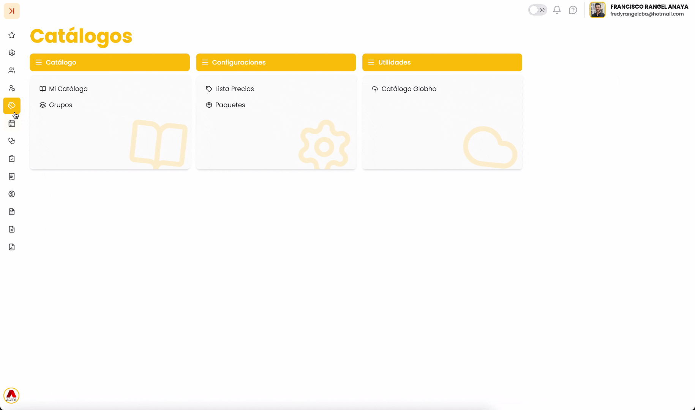

## Paso a paso instructivo.

1. En el menú lateral, selecciona la opción Catálogos.
2. Haz clic sobre Mi Catálogo.

   * Al ingresar, el sistema mostrará la pantalla principal del catálogo, donde podrás visualizar y administrar los productos registrados.

## Información visualizada en la tabla de Catálogo

En la pantalla principal del módulo **Catálogo**, se muestra una tabla con la información de los productos creados previamente.  
Cada fila corresponde a un producto y contiene los siguientes datos:

* **ES**: identificador único del producto dentro del sistema.
* **Código (RIPS)**
* **Código (CUM)**
* **Descripción**: nombre o descripción del producto.
* **Grupo**: grupo al que pertenece el producto.
* **Impuesto (%)**: tipo de impuesto aplicado al producto.
* **Valor Venta**: precio de venta configurado.
* **INV**: indica si el producto maneja control de inventario.
* **PyP:** Indica si el producto está asociado a PyP.
* **Acciones**: opciones disponibles para la gestión del producto.

**Adicionalmente**, en la parte superior se encuentran:

* **Filtros** para búsqueda de información:  11.47.25 a.m..png){ width=36 }
* **Opciones**  11.47.59 a.m..png){ width=35 }:

  + **Traslado**
  + **Exportar**
*  11.48.37 a.m..png){ width=33 } **Botón Crear** para registrar un nuevo ítem

---

## 3. Procedimientos principales

## 3.1 Crear un producto o servicio

1. Haga clic en el botón  11.48.37 a.m..png){ width=33 } **(Crear)**.
2. Se abrirá la ventana **Crear Catálogo**.
3. Complete la sección **Información Básica**:

   1. Seleccione el **Concepto / Grupo**.
   2. Ingrese:

      * **Código (RIPS)**
      * **Código de barras (opcional)**
      * **Código CUM (opcional)**
      * **Código SOAT (opcional)**
   3. Defina:

      * **Nivel**
      * **(%) Impuesto**
      * **Valor Venta**
   4. Ingrese la **Descripción**.
4. (**Opcional**) Complete la sección **Avanzado**:

   * **Nombre comercial**
   * **Unidad de medida**
   * **Forma**
   * **Concentración**
   * **Presentación**
   * **Principio activo**
   * **Valores mínimos, máximos y dosis**
5. (**Opcional**) Revise la sección **Contabilidad**  
   ⚠️ Esta opción **no está disponible al momento de crear**.
6. (Opcional) Configure **Tienda POS**:

   * **Activo**
   * **Controlar inventario**
   * **PyP**
7. Haga clic en **Crear** para guardar.

---

## 3.2 Editar un producto o servicio

1. Ubique el registro en la tabla.
2. Haga clic en los **tres puntos**  2.12.31 p.m..png){ width=40 } en la columna **Acciones**.
3. Seleccione **Editar Catálogo**.
4. Modifique la información necesaria.
5. Guarde los cambios.

---

## 3.3 Ver detalle del producto

1. En la columna **Acciones**, haga clic en  2.12.31 p.m..png){ width=40 }.
2. Seleccione **Ver Detalle**.

En esta vista podrá consultar:

### Información

* Datos generales del producto
* Información comercial (precio, impuesto, costos)
* Configuración de inventario

### Movimientos

* Últimos movimientos del producto (**si existen**)

### Proveedores

* Proveedores asociados al producto

---

## 3.4 Configurar cuentas contables

1. En la columna **Acciones**, haga clic  2.12.31 p.m..png){ width=40 }.
2. Seleccione **Configurar Cuentas**.
3. En la ventana de edición, asigne:

### Cuentas Operativas

* Cuenta ingreso
* Cuenta inventario
* Cuenta gasto
* Cuenta costo
* Cuenta entrada

### Impuestos y Retenciones

* Cuenta IVA venta
* Cuenta IVA compra
* Cuenta retefuente compra
* Cuenta reteICA compra

### Depreciación

* Cuenta depreciación débito
* Cuenta depreciación crédito

4. Haga clic en **Guardar**.

---

## 3.5 Consultar saldos de inventario

1. En la columna **Acciones**, haga clic en  2.12.31 p.m..png){ width=40 }.
2. Seleccione **Gestión Saldos**.
3. Se mostrará una ventana con:

   * **Listado de bodegas**
   * **Cantidad** **disponible** por cada **una**

---

## Exportar Catálogo

El sistema permite exportar todo el catálogo completo en diversos formatos, dependiendo de la necesidad del usuario. Para acceder a esta opción:

* Accede a la opción **Exportar** desde el menú de **operaciones**  2.40.49 p.m..png){ width=31 } .

Para conocer más sobre la herramienta **Exportar,** visita la sección Generar

---

!!! success "Buenas prácticas"
    ✔️ **Registrar** correctamente el **grupo** del producto o servicio  
    ✔️ **Validar** el **impuesto** antes de guardar  
    ✔️ **Activar** **control de inventario** solo cuando aplique  
    ✔️ **Mantener** actualizados los **precios de venta**  
    ✔️ **Configurar** las **cuentas contables** después de crear el producto  
    ✔️ **Revisar** los **saldos de inventario** periódicamente

!!! info video-tutorial "▶️ Vídeo tutorial"

{ width=760 }
