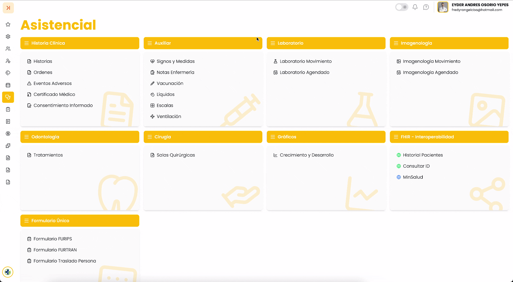

## 1. Acceso al módulo

Para realizar el envío del RDA del paciente:

1. Diríjase a Asistencial.
2. Ingrese a Historias.
3. Abra una **Historia Clínica** previamente creada.
4. En la parte superior derecha, haga clic en el botón de **opciones (⋯)**.
5. Seleccione la opción **“Envío RDA Paciente”**.

!!! info video-tutorial "📌 Este proceso se realizadespués de haber creado la historia clínica."

---

## 2. Descripción de la pantalla o tabla

Al seleccionar la opción, se abre una ventana emergente llamada:

### **Envío de RDA Paciente – MINSALUD**

En esta ventana encontrará:

### 🔹 Sección: Payload FHIR

* Visualización de la información en formato técnico.
* Interruptor para cambiar entre:

  + **JSON**
  + **Bundle**
* Botón  3.36.38 p.m..png){ width=163 }
* Iconos para copiar  3.37.14 p.m..png){ width=27 } o descargar  3.37.38 p.m..png){ width=21 } la información (según disponibilidad en pantalla)

### 🔹 Sección: Respuestas

* Historial de envíos realizados.
* Estado del envío:

  + ✅ Exitoso (autorizado)
  + ❌ Error (con detalle técnico)
* Información como:

  + **Fecha y hora**
  + **Usuario que realizó el envío**
  + **Identificador FHIR**

---

## 4. Procedimientos principales

### 4.1 Enviar RDA del paciente

1. Ingrese a una **Historia Clínica**.
2. Haga clic en el botón  3.43.30 p.m..png){ width=35 } ubicado en la parte superior derecha.
3. Seleccione **“Envío RDA Paciente”**.
4. En la ventana emergente:

   1. Revise la información generada (opcional).
   2. Seleccione el formato:

      * JSON o
      * Bundle (usando el interruptor 3.44.29 p.m..png){ width=45 }).
   3. Haga clic en  3.36.38 p.m..png){ width=163 }.
5. Espere la respuesta del sistema.

!!! warning "Nota"
    **Nota:** Para crear correctamente una historia clínica, consulte la guía: Historias

---

### 4.2 Consultar respuesta del envío

1. Dentro de la misma ventana, haga clic en la pestaña **“Respuestas”**.
2. Revise el resultado del envío:

   * Si fue **exitoso**, aparecerá como autorizado.
   * Si presenta **error**, se mostrará el detalle correspondiente.

---

!!! success "Buenas prácticas"
    * **Verifique** que la **Historia Clínica esté completa** antes de enviar.
    * **Revise** la pestaña **Respuestas** después de cada envío.
    * En caso de error, **valide** la información registrada en la historia clínica.
    * **Realice** el envío solo cuando la información esté finalizada.
    * **Evite** realizar múltiples envíos innecesarios.

!!! info video-tutorial "▶️ Video tutorial"

{ width=760 }
