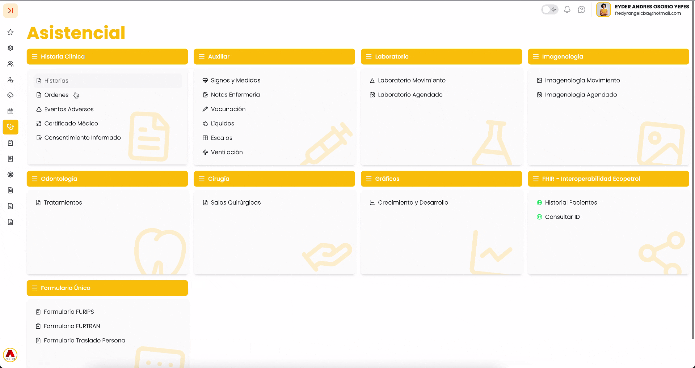

# 1. Acceso al módulo

Para acceder a la gestión de historias clínicas:

1. Ingrese al **Menú Lateral**.
2. Diríjase a Asistencial.
3. Seleccione la opción Historias.

---

# 2. Descripción de la pantalla o tabla

En esta sección se visualiza el listado de historias clínicas registradas en el sistema.

### Elementos visibles:

* **Filtros de búsqueda**  10.55.31 a.m..png){ width=34 }:

  + **Buscar paciente**
  + **Número de historia**
* **Tabla de resultados**, con columnas como:

  + **Número.**
  + **Estado**
  + **Tipo**
  + **Fecha**
  + **Paciente**
  + **Servicio**
  + **Diagnóstico principal**
  + **Evoluciones**
  + **Profesional**
  + **Cerrado**
  + **Acciones**
* **Botón de crear nueva historia**  10.56.28 a.m..png){ width=35 } (parte superior derecha)
* **Menú de acciones**  11.18.20 a.m..png){ width=27 } por cada registro:

  + **Ver detalle**
  + **Cerrar historia**
  + **Imprimir**
  + **Descargar**

---

# 3. Procedimientos principales

## 3.1 Crear una nueva historia clínica

1. Haga clic en el botón  10.56.28 a.m..png){ width=35 } (Crear).
2. En **Nueva Historia**:

   **Seleccionar paciente:**

   1. Haga clic en el campo **Buscar paciente**.
   2. Seleccione el paciente correspondiente.

   **Seleccionar cita (opcional):**  
   3. Haga clic en **Seleccionar** en la sección *Cita*.  
   4. Elija una cita disponible del listado.

   **Seleccionar tipo de historia:**  
   5. En la sección **General**, seleccione **Consulta o** la que requiera **(Para este ejemplo, utilizaremos Consulta General)** .
3. Haga clic en **Crear**.

---

## **3.2 Diligenciar la historia clínica (Consulta)**

Una vez creada la historia clínica, el sistema mostrará un formulario organizado por secciones para facilitar el registro de la información asistencial del paciente.

Las secciones principales del formulario son:

* **Información General**
* **Consulta**
* **Antecedentes**
* **Sistemas**
* **Examen Físico**
* **Diagnóstico**
* **Plan**

---

### **Información General**

En esta sección se registran los datos básicos de la atención, como:

* Fecha
* Hora
* Servicio asociado a la consulta

---

### **Antecedentes**

La sección Antecedentes permite registrar información clínica relevante del paciente relacionada con condiciones previas, antecedentes familiares, medicamentos y alergias.

El sistema organiza esta información en diferentes categorías:

* Antecedente Alérgico
* Antecedente Patológico
* Antecedente Farmacológico
* Antecedente Familiar

Cada categoría permite agregar múltiples registros mediante el botón:  3.17.22 p.m..png){ width=398 }

Además, cada registro incluye:

* Nombre
* Descripción
* Clasificación

!!! info video-tutorial "📌 Importante:Los antecedentes solicitados en el formulario cumplen con lineamientos y estructuras definidas por el Ministerio de Salud y Protección Social (MINSALUD), siguiendo los estándares de interoperabilidad clínica establecidos en Vulcano RDA."

#### **Referencias utilizadas por el sistema**

| **Tipo de antecedente** | **Referencia** |
| --- | --- |
| **Antecedente Alérgico** | <https://vulcano.ihcecol.gov.co/StructureDefinition-AllergyIntoleranceStatementRDA> |
| **Antecedente Patológico** | <https://vulcano.ihcecol.gov.co/StructureDefinition-ConditionStatementRDA> |
| **Antecedente Farmacológico** | <https://vulcano.ihcecol.gov.co/StructureDefinition-MedicationStatementRDA> |
| **Antecedente Familiar** | <https://vulcano.ihcecol.gov.co/StructureDefinition-FamilyMemberHistoryRDA> |

---

### **Sistemas**

En esta sección el profesional puede registrar la revisión por sistemas correspondiente a la consulta del paciente.

---

### **Examen Físico**

Permite diligenciar la información relacionada con la valoración física realizada durante la atención médica, además de signos y medidas.

---

### **Diagnóstico**

La sección de diagnóstico permite registrar:

* Diagnóstico principal
* Diagnósticos relacionados
* Tipo de diagnóstico
* Análisis clínico

Adicionalmente, el sistema incluye el apartado Factor Riesgo, donde es posible registrar factores asociados al estado clínico del paciente.

Cada factor de riesgo puede incluir:

* Nombre
* Descripción
* Clasificación

!!! info video-tutorial "📌 Importante:El registro de factores de riesgo se encuentra alineado con los lineamientos definidos por MINSALUD para interoperabilidad y registro clínico."

#### **Referencia utilizada**

| **Elemento** | **Referencia** |
| --- | --- |
| **Factor Riesgo** | <https://vulcano.ihcecol.gov.co/StructureDefinition-RiskFactorRDA> |

---

### **Plan**

En esta sección se registran las indicaciones, conductas, procedimientos o planes definidos durante la atención médica.

---

## 3.3 Ver detalle de la cita

 11.23.48 a.m..png){ width=760 }

1. En la parte superior de la historia, ubique el campo **No. Cita**.
2. Haga clic sobre el **número**.
3. Se abrirá una ventana con el **Detalle de la Agenda**, donde podrá ver:

   * **Servicio**
   * **Paciente**
   * **Profesional**
   * **Fecha y hora**
   * **Ubicación**

---

## 3.4 Ver información del paciente

1. Haga clic en el **icono azul**  11.24.41 a.m..png){ width=34 } (parte superior derecha).
2. Se desplegará un panel lateral con:

   * **Datos del paciente**
   * **Información de afiliación**
   * **Ubicación**

---

## 3.5 Ver historial clínico del paciente

1. Haga clic en el **icono rosado**  11.25.25 a.m..png){ width=34 }.
2. Se abrirá un panel lateral con el **historial clínico** del paciente.
3. Podrá visualizar registros anteriores organizados por fecha.

---

## 3.6 Guardar la historia clínica

1. Una vez diligenciada la información necesaria:
2. Haga clic en el botón  11.26.02 a.m..png){ width=105 } .

---

!!! success "Buenas prácticas"
    ✔️ **Verifiqu**e que el paciente seleccionado sea correcto antes de crear la historia  
    ✔️ **Asocie** la cita cuando esté disponible para mantener trazabilidad  
    ✔️ **Diligencie** la información de forma clara y completa  
    ✔️ **Revise** el historial clínico antes de registrar una nueva atención  
    ✔️ **Guarde** periódicamente la información para evitar pérdida de datos

!!! info video-tutorial "▶️ Video tutorial"

{ width=760 }

---

## 4. Ver detalle de una historia clínica

Para consultar el detalle completo de una historia clínica:

1. Ubique la historia en el listado.
2. Haga clic en el botón de **acciones**  11.18.20 a.m..png){ width=27 }.
3. Seleccione la opción **Ver detalle**.

---

### Información visible en el detalle

Al ingresar, se mostrará una pantalla con la información general de la historia:

#### Encabezado

* Número de historia clínica
* Número de registro clínico
* Fecha y hora
* Estado de la historia (Ej: Abierta)

#### Pestañas disponibles

* **Información**
* **Órdenes**
* **Evoluciones**
* **Hoja de Gasto**
* **Certificados**
* **Escalas**
* **Archivo**

---

### Sección: Información

Contiene:

* **Información general**
* **Información del paciente**
* **Detalle de la historia**

---

### Sección: Órdenes

* Permite visualizar y agregar órdenes médicas.
* Incluye columnas como:

  + **Servicio**
  + **Profesional**
  + **Paciente**
  + **Cantidad**
  + **Frecuencia**
  + **Duración**
  + **Observaciones**
* Botones disponibles:

  + **Agregar Órdenes**
  + **Enviar Email**
  + **Imprimir selección**

---

### Sección: Evoluciones

* Muestra el historial de evoluciones registradas en la historia clínica.
* Incluye información como:

  + **Fecha**
  + **Tipo**
  + **Descripción**
  + **Profesional**

---

### Acciones disponibles en el detalle

Ubicadas en la parte superior derecha:

* **Imprimir** 🖨️
* **Descargar** ⬇️
* **Más opciones**  11.18.20 a.m..png){ width=27 }:

  + **Enviar Email**
  + **Envío HL7 FHIR**
  + **Envío FevRIPS**
  + **Finalizar historia**

---

!!! success "Buenas prácticas"
    ### Consideraciones
    
    * La información mostrada depende del tipo de historia creada.
    * Algunas secciones pueden no contener datos si aún no han sido diligenciadas.

!!! info video-tutorial "▶️ Video tutorial"

{ width=764 }
