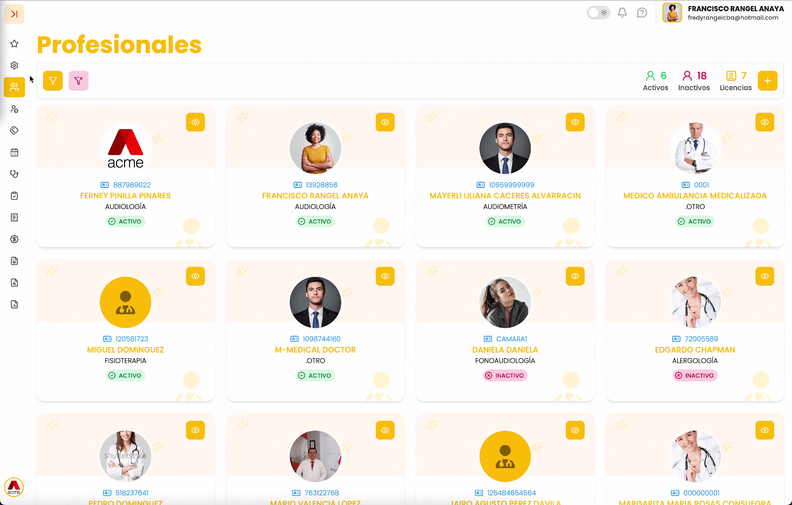
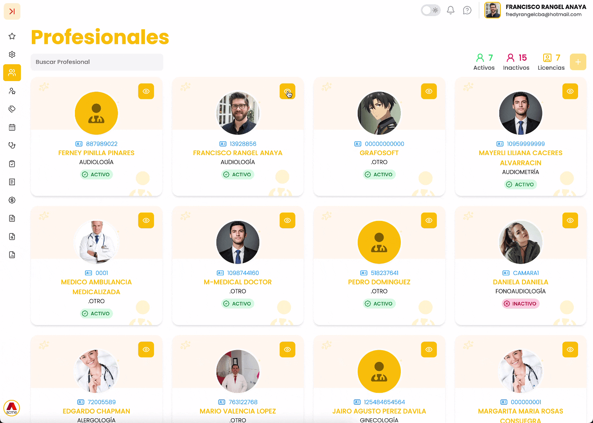

## 1. Acceso al módulo

Para ingresar al módulo **Profesionales**, siga estos pasos:

1. Ubíquese en la **barra lateral izquierda** del sistema.
2. Haga clic en la opción **“Profesionales”**.

El sistema mostrará la pantalla principal con el listado de profesionales registrados.

---

## 2. Descripción de la pantalla principal

Al ingresar al módulo se visualiza:

* Campo **Buscar Profesional** para realizar búsquedas por nombre o identificación.
* Indicadores en la parte superior derecha:

  + 🟢 Activos
  + 🔴 Inactivos
  + 🟡 Licencias
* Botón  9.17.09 a.m..png){ width=36 } para crear un **nuevo** **profesional**.
* Tarjetas individuales con la siguiente información:

  + **Número de documento**
  + **Nombre completo**
  + **Especialidad**
  + Activo
  + **Botón con ícono de**  9.18.11 a.m..png){ width=31 } **para ver el detalle**

---

## 3. ¿Qué se puede hacer en este módulo?

Desde el módulo **Profesionales**, el usuario puede:

1. **Consultar** el listado de profesionales.
2. **Buscar** profesionales específicos.
3. **Crear** nuevos profesionales.
4. **Consultar** el detalle completo de cada profesional.
5. **Editar** información.
6. **Configurar** permisos y parámetros asociados.
7. **Consultar** sesiones activas.
8. **Gestionar** archivos relacionados (Ej. hoja de vida).

---

## 4. Procedimientos principales

### 4.1 Crear un nuevo profesional

1. Haga clic en el botón  9.17.09 a.m..png){ width=36 } ubicado en la parte superior derecha.
2. Se abrirá la ventana **Crear Profesional**.
3. Complete la sección **Información Profesional**:

   * **Tipo de identificación**
   * **Número de documento**
   * **Nombres y apellidos**
   * **Ciudad**
   * **Teléfono**
   * **Especialidad**
   * **Tipo profesional**
   * **Sede**
4. Si corresponde, marque:

   * **Práctica Formativa en Salud**
   * **Agendamiento**
5. Complete la sección **Datos de Acceso**:

   * **Correo electrónico (Usuario)**
   * **Contraseña**
   * **Confirmar contraseña**
6. Haga clic en **Crear** para guardar.

---

### 4.2 Ver detalle del profesional

1. Ubique el profesional en el listado.
2. Haga clic en el botón con ícono  9.18.11 a.m..png){ width=31 }.
3. El sistema abrirá la pantalla de detalle.

!!! info video-tutorial "▶️ Video Tutorial"

{ width=760 }

---

## 5. Secciones dentro del Detalle del Profesional

En la parte superior se visualizan las siguientes pestañas:

* **Información**
* **Configuración**
* **Permisos**
* **Tarifa**
* **Sesiones**
* **Archivo**

---

### 5.1 Información

En esta pestaña se visualiza:

* **Información general como:**

  + Número de documento
  + Nombre
  + Tipo profesional
  + Especialidad
  + Cargo
* **Ubicación y contacto**
* **Información de Empresa**

#### Firma de formatos

Permite cargar la imagen de la firma del profesional mediante el botón **Subir Archivo**.

---

### 5.2 Configuración ⚙️

En esta sección se visualizan configuraciones asociadas al profesional, tales como:

* **Numeraciones**
* **Bancos**
* **Sedes**

Aquí se gestionan los parámetros que relacionan al profesional con estos elementos dentro del sistema.

---

### 5.3 Permisos 🔐

Permite habilitar o deshabilitar permisos específicos por módulo.

!!! info "Información"
    Los permisos se organizan por secciones (por ejemplo: **Admisión, Activos, Usuarios, Bancos, Catálogo, CRM,** entre otros).

Cada permiso cuenta con un interruptor que permite:

* Activar la funcionalidad
* Desactivarla según el rol del profesional

!!! warning "Nota"
    **Nota visible en pantalla**  
    Para que los cambios se apliquen correctamente, es necesario cerrar sesión y volver a iniciarla.

---

### 5.4 Tarifa

En esta pestaña se configuran las tarifas asociadas al profesional, según los servicios que tenga asignados.

---

### 5.5 Sesiones 🖥️

En esta sección se visualizan las sesiones activas que ha tenido el usuario.

Permite consultar información relacionada con los accesos realizados al sistema.

---

### 5.6 Archivo 📁

En esta sección se visualizan todos los archivos cargados asociados al profesional.

Ejemplos:

* **Hoja de vida (CV)**
* **Documentos administrativos**
* **Certificaciones**

---

## 6. Acciones disponibles en el detalle

En la parte superior derecha del detalle del profesional se encuentran botones que permiten:

*  9.08.48 a.m..png){ width=34 } **Editar** **información** del profesional.
*  9.09.23 a.m..png){ width=31 } **Cambiar** o **actualizar** la fotografía.
*  9.10.00 a.m..png){ width=36 } **Opciones** adicionales según configuración del sistema.

---

!!! success "Buenas prácticas ✅"
    * **Verifique** que el profesional no exista antes de crearlo.
    * **Asigne** correctamente la sede y especialidad.
    * **Revise** los permisos antes de habilitar el acceso.
    * **Solicite** al profesional cerrar sesión después de modificar permisos.
    * **Mantenga** actualizados los documentos en la pestaña Archivo.

!!! info video-tutorial "▶️ Video Tutorial"

{ width=760 }
